```{=openxml}
<w:p><w:pPr><w:jc w:val="center"/></w:pPr><w:r><w:rPr><w:b/><w:sz w:val="36"/></w:rPr><w:t>A PROJECT REPORT</w:t></w:r></w:p>
<w:p><w:pPr><w:jc w:val="center"/></w:pPr><w:r><w:rPr><w:sz w:val="24"/></w:rPr><w:t>ON</w:t></w:r></w:p>
<w:p><w:pPr><w:jc w:val="center"/></w:pPr><w:r><w:rPr><w:b/><w:sz w:val="40"/></w:rPr><w:t>DevGen: A Hybrid Neuro-Generative Framework for Devanagari Handwritten Text Recognition and Synthesized Word Augmentation</w:t></w:r></w:p>
<w:p/>
<w:p><w:pPr><w:jc w:val="center"/></w:pPr><w:r><w:rPr><w:sz w:val="24"/></w:rPr><w:t>Submitted in partial fulfillment of the requirements for the degree of</w:t></w:r></w:p>
<w:p><w:pPr><w:jc w:val="center"/></w:pPr><w:r><w:rPr><w:b/><w:sz w:val="26"/></w:rPr><w:t>Bachelor of Science in Computer Science and Information Technology (B.Sc. CSIT)</w:t></w:r></w:p>
<w:p/>
<w:p><w:pPr><w:jc w:val="center"/></w:pPr><w:r><w:rPr><w:sz w:val="24"/></w:rPr><w:t>Submitted By</w:t></w:r></w:p>
<w:p><w:pPr><w:jc w:val="center"/></w:pPr><w:r><w:rPr><w:b/><w:sz w:val="26"/></w:rPr><w:t>Manish (DevGen Project Team)</w:t></w:r></w:p>
<w:p/>
<w:p><w:pPr><w:jc w:val="center"/></w:pPr><w:r><w:rPr><w:sz w:val="24"/></w:rPr><w:t>Submitted To</w:t></w:r></w:p>
<w:p><w:pPr><w:jc w:val="center"/></w:pPr><w:r><w:rPr><w:b/><w:sz w:val="26"/></w:rPr><w:t>Department of Computer Science and Information Technology</w:t></w:r></w:p>
<w:p><w:pPr><w:jc w:val="center"/></w:pPr><w:r><w:rPr><w:sz w:val="24"/></w:rPr><w:t>Tribhuvan University</w:t></w:r></w:p>
<w:p/>
<w:p><w:pPr><w:jc w:val="center"/></w:pPr><w:r><w:rPr><w:sz w:val="24"/></w:rPr><w:t>2026</w:t></w:r></w:p>
<w:p><w:r><w:br w:type="page"/></w:r></w:p>
```

# Certificate Page

## i. Supervisor's Recommendation

This is to certify that the project report entitled **"DevGen: A Hybrid Neuro-Generative Framework for Devanagari Handwritten Text Recognition and Synthesized Word Augmentation"** has been prepared and carried out by **Manish** under my supervision and guidance, in partial fulfillment of the requirements for the degree of Bachelor of Science in Computer Science and Information Technology. To the best of my knowledge, this work is original and has not been submitted elsewhere for any degree or diploma. I hereby recommend this report for examination and approval.

&nbsp;

&nbsp;

\_\_\_\_\_\_\_\_\_\_\_\_\_\_\_\_\_\_\_\_\_\_\_

**Signature of Supervisor**

Name: \_\_\_\_\_\_\_\_\_\_\_\_\_\_\_\_\_\_\_

Designation: Project Supervisor

Date: \_\_\_\_\_\_\_\_\_\_\_\_\_\_\_\_\_\_\_

## ii. Letter of Approval

This is to certify that this project report prepared by **Manish**, entitled **"DevGen: A Hybrid Neuro-Generative Framework for Devanagari Handwritten Text Recognition and Synthesized Word Augmentation"**, has been examined and accepted as a partial fulfillment of the requirements for the degree of Bachelor of Science in Computer Science and Information Technology.

&nbsp;

| | |
|---|---|
| \_\_\_\_\_\_\_\_\_\_\_\_\_\_\_\_\_\_\_ | \_\_\_\_\_\_\_\_\_\_\_\_\_\_\_\_\_\_\_ |
| **Supervisor** | **Head of Department / Program Coordinator** |
| | |
| \_\_\_\_\_\_\_\_\_\_\_\_\_\_\_\_\_\_\_ | \_\_\_\_\_\_\_\_\_\_\_\_\_\_\_\_\_\_\_ |
| **Internal Examiner** | **External Examiner** |

```{=openxml}
<w:p><w:r><w:br w:type="page"/></w:r></w:p>
```

# Acknowledgement

I would like to express my deepest gratitude to my project supervisor for the invaluable guidance, encouragement, and constructive feedback provided throughout the course of this project. Their insight into machine learning practice and academic writing shaped both the technical direction and the presentation of this work.

I am equally grateful to the Head of Department, the internal and external examiners, and the academic coordinators of the Department of Computer Science and Information Technology, Tribhuvan University, for their continuous support and for providing an environment conducive to independent research.

I extend my sincere thanks to the global open-source community — in particular the developers and maintainers of PyTorch, Hugging Face Transformers, PEFT, Diffusers, OpenCV, and FastAPI — whose foundational tools, pre-trained models, and public datasets made this research feasible on modest consumer hardware. I also acknowledge the authors of the IIIT-INDIC-HW-WORDS and Devanagari Handwritten Character datasets, without which the recognition components could not have been trained.

Finally, I thank my family and friends for their patience, motivation, and encouragement during the long development and experimentation cycles of this project.

```{=openxml}
<w:p><w:r><w:br w:type="page"/></w:r></w:p>
```

# Abstract

Handwritten Devanagari character and word recognition remain challenging due to high stroke complexity, wide variation in individual writing styles, conjunct glyphs, dependent vowel signs (*matras*), and the persistent scarcity of large, labeled handwriting datasets. This work presents **DevGen**, a hybrid neuro-generative system that combines an Optical Character Recognition (OCR) pipeline with a generative data-augmentation framework, and packages the result as a usable web application.

The OCR pipeline employs a fast, rule-based **Smart ImageRouter** that dispatches an input crop based on its ink topology and bounding-box aspect ratio: isolated single characters are classified by a custom three-block Convolutional Neural Network (CNN) trained on the Devanagari Handwritten Character Dataset (DHCD), while multi-character words are decoded by a Transformer-based OCR (TrOCR) model fine-tuned with Low-Rank Adaptation (LoRA) on the IIIT-INDIC-HW-WORDS Hindi dataset. Recognized text is passed to a rule-based Named Entity Recognition (NER) module that extracts administrative fields such as dates, citizenship numbers, districts, and land-plot numbers from Nepali documents. To address data scarcity, two generative frameworks were designed and empirically compared: an **Advanced StyleGAN with Attention (StyleGAN-Attn)** built from a bidirectional-GRU spatial text encoder, StyleGAN2-style weight demodulation, lightweight bottleneck self-attention, and CTC text-recognizer guidance; and a **Latent Diffusion Model (LDM) with ControlNet** conditioning.

All fine-tuning was optimized for consumer Apple Silicon using the PyTorch Metal Performance Shaders (MPS) backend, avoiding any dependency on cloud GPUs. The TrOCR + LoRA adapter reached a best validation Character Error Rate (CER) of **0.1380** on the development subset while training only **2.45%** of the model's parameters (4.62 M of 188.7 M). The custom CNN reached **98.2%** accuracy on the clean DHCD test split, though its accuracy collapsed to **15.71%** on characters segmented out of real words — a result that quantifies the fragility of segmentation-based recognition and motivates the segmentation-free TrOCR path. The StyleGAN-Attn network stabilized and produced visually convincing strokes, whereas the LDM-ControlNet pipeline suffered from stroke instability and CLIP text-encoder limitations. The complete suite is served through a FastAPI backend and a React/Vite frontend supporting real-time recognition, entity extraction, CER evaluation, dataset browsing, and synthetic generation.

**Keywords:** Devanagari OCR, TrOCR, LoRA, PEFT, StyleGAN-Attention, ControlNet, Latent Diffusion, Apple Silicon MPS, Character Error Rate, Named Entity Recognition.

```{=openxml}
<w:p><w:r><w:br w:type="page"/></w:r></w:p>
```

# Table of Contents

- Certificate Page
- Acknowledgement
- Abstract
- List of Abbreviations
- List of Figures
- List of Tables
- **Chapter 1: Introduction**
  - 1.1 Introduction
  - 1.2 Problem Statement
  - 1.3 Objectives
  - 1.4 Scope and Limitation
  - 1.5 Development Methodology
  - 1.6 Report Organization
- **Chapter 2: Background Study and Literature Review**
  - 2.1 Background Study
  - 2.2 Literature Review
- **Chapter 3: System Analysis**
  - 3.1 System Analysis
    - 3.1.1 Requirement Analysis (Functional / Non-Functional)
    - 3.1.2 Feasibility Analysis (Technical / Operational / Economic / Schedule)
    - 3.1.3 Object-Oriented Analysis (Class, Sequence, Activity, State)
- **Chapter 4: System Design**
  - 4.1 Design (Refined Class, Component, Deployment)
  - 4.2 Algorithm Details
- **Chapter 5: Implementation and Testing**
  - 5.1 Implementation (Tools Used / Module Details)
  - 5.2 Testing (Unit / System Test Cases)
  - 5.3 Result Analysis
- **Chapter 6: Conclusion and Future Recommendations**
  - 6.1 Conclusion
  - 6.2 Future Recommendations
- References
- Bibliography
- Appendices

```{=openxml}
<w:p><w:r><w:br w:type="page"/></w:r></w:p>
```

# List of Abbreviations

| Abbreviation | Meaning |
|---|---|
| API | Application Programming Interface |
| CER | Character Error Rate |
| CNN | Convolutional Neural Network |
| CORS | Cross-Origin Resource Sharing |
| CTC | Connectionist Temporal Classification |
| DHCD | Devanagari Handwritten Character Dataset |
| EMA | Exponential Moving Average |
| FID | Fréchet Inception Distance |
| GAN | Generative Adversarial Network |
| GRU | Gated Recurrent Unit |
| LDM | Latent Diffusion Model |
| LoRA | Low-Rank Adaptation |
| MPS | Metal Performance Shaders |
| NER | Named Entity Recognition |
| OCR | Optical Character Recognition |
| OOD | Out-of-Distribution |
| PEFT | Parameter-Efficient Fine-Tuning |
| ReLU | Rectified Linear Unit |
| REST | Representational State Transfer |
| RNN | Recurrent Neural Network |
| SD | Stable Diffusion |
| TTUR | Two Time-scale Update Rule |
| ViT | Vision Transformer |
| WER | Word Error Rate |

# List of Figures

| Figure | Title |
|---|---|
| Figure 1.1 | Smart ImageRouter Decision Flow |
| Figure 3.1 | Use Case Diagram |
| Figure 3.2 | Class Diagram (Analysis) |
| Figure 3.3 | Sequence Diagram — Recognize and Extract |
| Figure 3.4 | Activity Diagram — Recognition Pipeline |
| Figure 3.5 | State Diagram — Request Lifecycle |
| Figure 4.1 | Component Diagram |
| Figure 4.2 | Deployment Diagram |
| Figure 4.3 | DevGen System Block Architecture |
| Figure 4.4 | StyleGAN-Attention Generator and Discriminator |
| Figure 4.5 | LDM ControlNet Pipeline |

# List of Tables

| Table | Title |
|---|---|
| Table 2.1 | Comparison of Related Work |
| Table 3.1 | Use Case Descriptions |
| Table 3.2 | Hardware and Software Requirements |
| Table 3.3 | Estimated Project Cost |
| Table 3.4 | Project Schedule |
| Table 4.1 | DHCD CNN Character Classifier Layer Specification |
| Table 5.1 | Hardware and Software Tool Stack |
| Table 5.2 | Dataset Split Sizes |
| Table 5.3 | TrOCR Validation CER across Checkpoints |
| Table 5.4 | Summary of Test Cases |
| Table 5.5 | OCR Sequence Recognition Results (TrOCR + LoRA) |
| Table 5.6 | Character Classification Results (Custom CNN) |
| Table 5.7 | StyleGAN-Attention OCR Read Correctness |

```{=openxml}
<w:p><w:r><w:br w:type="page"/></w:r></w:p>
```

# Chapter 1: Introduction

## 1.1 Introduction

Optical Character Recognition (OCR) is the process of converting images of typed, printed, or handwritten text into machine-encoded text. For printed Latin scripts, OCR is largely a solved problem; however, OCR for *handwritten Indic scripts* remains an open and difficult research area. Devanagari — the script used to write Nepali, Hindi, Sanskrit, Marathi, and several other languages spoken by more than half a billion people — is among the most structurally complex scripts for machine reading.

Devanagari is written left-to-right and, unlike Latin, binds the characters of a word together beneath a continuous upper horizontal headline called the *Shirorekha*. Each of its 36 base consonants can carry dependent vowel signs (*matras*) attached above, below, before, or after the consonant, and consonants frequently combine into compound *conjunct* glyphs whose shapes differ from their constituents. Added to this intrinsic structural density is the enormous variability of human handwriting: differences in slant, stroke thickness, spacing, and personal writing habits mean that the same word can appear in thousands of visually distinct forms. Classical OCR pipelines, which detect and segment individual characters before classifying them, are highly fragile under these conditions, because a single segmentation error propagates and corrupts the entire downstream recognition.

**DevGen** addresses these challenges using a *neuro-generative* approach that unites two complementary ideas. First, it builds a robust *hybrid recognizer* that combines a lightweight CNN classifier for isolated characters and digits with a powerful, segmentation-free Transformer OCR model for words, arbitrated by a fast rule-based router. Second, it treats the underlying data-scarcity problem directly by studying *generative models* — a StyleGAN with attention and a latent diffusion model — that can, in principle, synthesize additional labeled handwriting samples to augment training. Recognized text is further passed through an entity-extraction stage that captures structured administrative fields, making the system useful for real document-digitization scenarios such as the processing of Nepali government forms, land records, and citizenship documents.

The entire system was intentionally developed and trained on a consumer Apple Silicon laptop using PyTorch's Metal Performance Shaders backend, demonstrating that modern parameter-efficient adaptation techniques bring transformer-scale OCR within reach of individuals and institutions without access to dedicated GPU clusters or paid cloud compute.

## 1.2 Problem Statement

Traditional OCR pipelines rely heavily on hand-crafted segmentation and preprocessing. When applied to irregular handwriting, segmentation errors cascade: the *Shirorekha* is difficult to remove cleanly, *matras* are split from or merged into their base characters, and adjacent strokes bleed together. Modern vision-transformer OCR models resolve much of this fragility by treating recognition as end-to-end image-to-sequence generation, but they contain hundreds of millions of parameters and are conventionally trained on large GPU clusters, placing full fine-tuning out of reach for most students and small organizations.

Compounding these issues, publicly available Devanagari *handwriting* datasets are scarce compared with printed or Latin-script corpora, which limits the generalization of any model trained on them. There is therefore a clear, practical need for: (a) a recognition workflow that is both accurate and *parameter-efficient* enough to train locally on accessible hardware such as Apple Silicon; and (b) a *generative data-augmentation* method capable of producing realistic and structurally sound synthetic handwritten words to enlarge the effective training set. DevGen is designed to investigate both needs within a single, deployable framework.

## 1.3 Objectives

The primary objective is to design, implement, and evaluate a hybrid neuro-generative framework for Devanagari handwritten text recognition and synthetic augmentation. The specific objectives are:

- To design a hybrid OCR pipeline that combines a fast rule-based image router, a lightweight CNN character classifier, and a LoRA-fine-tuned TrOCR word recognizer.
- To implement parameter-efficient fine-tuning (PEFT) of a transformer OCR model locally on macOS using the PyTorch MPS backend.
- To build a conditional word-image generator using a StyleGAN with attention and CTC recognizer guidance.
- To evaluate a Latent Diffusion Model with ControlNet conditioning for handwriting generation and to compare it rigorously against the GAN.
- To extract structured entities (dates, IDs, districts, plot numbers) from recognized text using rule-based Named Entity Recognition.
- To deploy the complete suite through a FastAPI backend and a React frontend supporting real-time inference, evaluation, and analysis.

## 1.4 Scope and Limitation

**Scope.** The framework targets *single-character* recognition (46 classes: 36 consonants/letters and 10 digits) and *word-crop* recognition. It provides preprocessing, smart routing, character classification, word OCR, rule-based entity extraction, CER evaluation, dataset inspection, and two synthetic-generation pathways, all exposed through a web interface.

**Limitation.** The system does not perform document-level layout analysis, text-line detection, or paragraph segmentation; it assumes the input is already a character crop or a word crop. The generative modules produce grayscale word crops of fixed size 256 × 64 pixels. Validation CER during training was computed on a 1,000-sample development subset (for practical MPS evaluation time) rather than the full test split, so reported development CER should be treated as an indicative metric. The NER module is rule-based (regular expressions) and therefore covers only the patterns explicitly encoded. Token-level confidence shown in the UI is a diagnostic indicator derived from beam-search sequence scores and is not a calibrated probability.

## 1.5 Development Methodology

The project followed an **incremental and iterative** methodology, in which the system was built and validated module by module, and earlier modules were revisited as later ones exposed new requirements (for example, the discovery that inference preprocessing had to be revised to match the training distribution). The main phases were:

1. **Requirement study and data acquisition.** Identify functional/non-functional requirements; acquire and locally extract the DHCD and IIIT-INDIC-HW-WORDS datasets.
2. **Data preprocessing and smart routing.** Implement adaptive thresholding, deskewing, denoising, and a flood-fill/aspect-ratio router that dispatches crops to the CNN (isolated characters) or TrOCR (words).
3. **Recognition model development.** Train the custom CNN on DHCD; attach rank-16 LoRA adapters to a Devanagari TrOCR checkpoint and fine-tune on Apple Silicon.
4. **Generative modeling.** Build and stabilize a StyleGAN with attention using hinge loss, spectral normalization, translation-only DiffAugment, and CTC guidance.
5. **LDM ControlNet exploration.** Condition Stable Diffusion v1-5 on rendered-glyph control images and evaluate feasibility.
6. **Integration and deployment.** Expose all modules through a FastAPI REST API and a React/Vite dashboard.
7. **Testing and evaluation.** Measure performance via Character Error Rate, classification accuracy, and diagnostic precision/recall/F1, and analyse failure modes.

## 1.6 Report Organization

This report is organized into six chapters. **Chapter 1** introduces the project, its motivation, objectives, scope, and methodology. **Chapter 2** presents the theoretical background and a review of related work. **Chapter 3** covers requirement analysis, feasibility analysis, and object-oriented analysis with supporting diagrams. **Chapter 4** elaborates the refined system design and the detailed mathematical and algorithmic formulations. **Chapter 5** describes implementation tools, module-level details, testing, and result analysis. **Chapter 6** concludes the work and outlines future recommendations. The report ends with references, a bibliography, and appendices containing source-code excerpts, an API reference, research-paper links, and a log of supervisor visits.

```{=openxml}
<w:p><w:r><w:br w:type="page"/></w:r></w:p>
```

# Chapter 2: Background Study and Literature Review

## 2.1 Background Study

This section reviews the fundamental theories, concepts, and terminology on which DevGen is built.

### 2.1.1 The Devanagari Script

Devanagari is an *abugida* (alphasyllabary) in which the basic writing unit is a consonant carrying an inherent vowel. It comprises 36 base consonants (व्यंजन), 12–14 vowels (स्वर) with corresponding dependent vowel signs (*matras*), and 10 numerals (०–९). Distinctive structural properties that complicate machine recognition include: (1) the continuous *Shirorekha* headline that joins the tops of characters in a word; (2) *matras* that attach above, below, before, or after a consonant; (3) *conjunct* clusters (संयुक्ताक्षर) formed by combining two or more consonants into a single ligature; and (4) strong inter-writer variability. These properties mean that the number of visually distinct glyph forms greatly exceeds the nominal alphabet size.

### 2.1.2 Digital Image Preprocessing

Before recognition, raw images are cleaned to reduce noise and normalize geometry. *Grayscale conversion* reduces a colour image to a single intensity channel. *Adaptive thresholding* binarizes the image using a locally computed threshold $T(x,y) = \mu_G(x,y) - C$, where $\mu_G$ is a Gaussian-weighted neighborhood mean; this is more robust to uneven illumination than a single global threshold. *Deskewing* corrects rotational distortion by detecting dominant near-horizontal lines using the Hough transform in $(\rho,\theta)$ space and rotating the image by the negative of the estimated skew angle. *Non-local means denoising* removes speckle by averaging pixels with similar surrounding patches.

### 2.1.3 Convolutional Neural Networks

A CNN extracts local spatial features using learnable convolution kernels. A 2-D convolution of input $X$ with kernel $K$ produces a feature map $S(i,j) = \sum_m \sum_n X(i+m, j+n)\,K(m,n) + b$. Convolution layers are typically followed by a non-linearity such as the Rectified Linear Unit $\text{ReLU}(x) = \max(0, x)$, spatial down-sampling by *max pooling*, *batch normalization* to stabilize training, and *dropout* for regularization. The final classification layer applies the softmax function $\sigma(z)_i = e^{z_i} / \sum_j e^{z_j}$ to produce class probabilities, and the network is trained by minimizing the cross-entropy loss $\mathcal{L} = -\sum_i y_i \log \hat{y}_i$. DevGen's character classifier is a compact three-block CNN of this form.

### 2.1.4 Recurrent Networks and the GRU

Recurrent Neural Networks process sequences by maintaining a hidden state across time steps. The Gated Recurrent Unit (GRU) mitigates vanishing gradients using an update gate $z_t$ and a reset gate $r_t$:
$$z_t = \sigma(W_z x_t + U_z h_{t-1}), \quad r_t = \sigma(W_r x_t + U_r h_{t-1}),$$
$$\tilde{h}_t = \tanh(W_h x_t + U_h (r_t \odot h_{t-1})), \quad h_t = (1-z_t)\odot h_{t-1} + z_t \odot \tilde{h}_t.$$
A *bidirectional* GRU runs one GRU forward and one backward over the sequence and concatenates their states, giving each position access to both left and right context. DevGen uses a bidirectional GRU as the spatial text encoder in its generator.

### 2.1.5 Attention and the Transformer

The Transformer replaces recurrence with *self-attention*. Given queries $Q$, keys $K$, and values $V$, scaled dot-product attention computes
$$\text{Attention}(Q,K,V) = \text{Softmax}\!\left(\frac{QK^\top}{\sqrt{d_k}}\right)V,$$
allowing every position to attend to every other position in a single step and thereby capturing long-range dependencies — highly relevant for the continuous *Shirorekha* spanning a whole word. *Multi-head* attention runs several such projections in parallel, and *positional encodings* inject sequence order. These operations underlie both the encoder and decoder of the OCR model used here.

### 2.1.6 TrOCR

TrOCR frames OCR as image-to-text sequence generation. A Vision Transformer (ViT) encoder splits the input image into fixed-size patches, linearly embeds them, and processes them with Transformer encoder layers; an autoregressive Transformer *text decoder* then generates the output character sequence one token at a time, attending to the encoder features. Because it emits a sequence directly, TrOCR requires no explicit character segmentation, which is precisely why it is well suited to cursive, headline-joined Devanagari words. During inference, *beam search* keeps the $b$ most probable partial sequences at each step to approximate the most likely full sequence.

### 2.1.7 Transfer Learning and Parameter-Efficient Fine-Tuning (LoRA)

*Transfer learning* adapts a model pre-trained on a large corpus to a specific downstream task, reducing data and compute requirements. Full fine-tuning updates all weights and stores a full-size copy per task. *Low-Rank Adaptation (LoRA)* instead freezes the pre-trained weight $W_0$ and learns a low-rank update $\Delta W = BA$, so the effective weight becomes $W = W_0 + \frac{\alpha}{r}BA$, with $B \in \mathbb{R}^{d\times r}$, $A \in \mathbb{R}^{r\times k}$, and rank $r \ll \min(d,k)$. Only $A$ and $B$ are trained. This reduces the number of trainable parameters by one to two orders of magnitude and produces a compact, swappable adapter — the property that makes local Apple Silicon fine-tuning practical in DevGen.

### 2.1.8 Generative Adversarial Networks

A GAN pits a generator $G$ against a discriminator $D$ in a minimax game
$$\min_G \max_D \; \mathbb{E}_{x\sim p_{\text{data}}}[\log D(x)] + \mathbb{E}_{z\sim p_z}[\log(1 - D(G(z)))].$$
GAN training is notoriously unstable and prone to *mode collapse*. Several techniques stabilize it: *spectral normalization* constrains the discriminator's Lipschitz constant; the *hinge loss* replaces the log loss with margin-based terms; *DiffAugment* applies differentiable augmentations to both real and generated images to prevent discriminator overfitting on small datasets; the *Two Time-scale Update Rule (TTUR)* uses a larger learning rate for $D$ than $G$; and an *Exponential Moving Average (EMA)* of generator weights yields smoother samples at inference. *StyleGAN2* introduces *weight demodulation*, in which a learned style vector modulates convolution weights that are then normalized, decoupling global style from spatial content. *Self-attention GANs* add attention layers so the generator can model long-range structure. DevGen's generator combines all of these.

### 2.1.9 Diffusion Models, LDM, and ControlNet

Diffusion models learn to reverse a gradual noising process. In the forward process, Gaussian noise is added over $T$ steps, $q(x_t|x_{t-1}) = \mathcal{N}(x_t; \sqrt{1-\beta_t}\,x_{t-1}, \beta_t I)$; a network is trained to predict and remove that noise in the reverse process. *Latent Diffusion Models* perform this in a compressed latent space produced by a variational autoencoder, greatly reducing compute. *Stable Diffusion* conditions generation on a text prompt encoded by the CLIP text encoder. *ControlNet* adds a trainable copy of the U-Net encoder blocks, connected by zero-initialized convolutions, to inject an external spatial condition (such as a rendered-glyph edge map) without destabilizing the base model. DevGen evaluates this pipeline for handwriting synthesis.

### 2.1.10 Evaluation Metrics

- **Character Error Rate (CER):** the Levenshtein edit distance between prediction and reference normalized by reference length, $\text{CER} = \frac{S + D + I}{N}$ (substitutions, deletions, insertions over $N$ reference characters). Lower is better.
- **Word Exact-Match Accuracy:** fraction of words recognized with zero character errors.
- **Precision, Recall, F1:** at the character level, $P = \frac{|T_{\text{pred}} \cap T_{\text{gt}}|}{|T_{\text{pred}}|}$, $R = \frac{|T_{\text{pred}} \cap T_{\text{gt}}|}{|T_{\text{gt}}|}$, and $F_1 = \frac{2PR}{P+R}$.
- **Fréchet Inception Distance (FID):** measures the distance between real and generated feature distributions, $d^2 = \lVert \mu_r - \mu_g \rVert^2 + \text{Tr}(\Sigma_r + \Sigma_g - 2(\Sigma_r\Sigma_g)^{1/2})$; lower indicates more realistic generation.

## 2.2 Literature Review

**GAN-based handwriting synthesis.** Chhatkuli et al. (2021) demonstrated the generation of Nepali handwritten letters and words using generative adversarial networks, establishing feasibility for Devanagari but with limited stroke fidelity and no text-conditioning guarantee. DevGen extends this line by adding spectral normalization, DiffAugment, StyleGAN2 weight demodulation, self-attention, and — crucially — a CTC recognizer-in-the-loop loss intended to constrain the generated strokes to spell the conditioning text.

**Transformer OCR.** Li et al. (2021) introduced TrOCR, an end-to-end Transformer OCR that outperformed prior CNN-RNN systems on printed and handwritten benchmarks by removing explicit segmentation. DevGen adapts a Devanagari-specialized TrOCR checkpoint rather than a generic English one, because tokenizer, decoder prior, and visual distribution differ substantially across scripts.

**Parameter-efficient fine-tuning.** Hu et al. (2021) showed that LoRA matches full fine-tuning quality on large generation tasks while training a tiny fraction of parameters and producing compact adapters. This directly enables DevGen's local Apple Silicon workflow.

**Style-based and self-attention GANs.** Karras et al. (StyleGAN2, 2020) and Zhang et al. (SAGAN, 2019) contributed the weight-demodulation and self-attention mechanisms respectively that DevGen's generator adopts. Miyato et al. (2018), Zhao et al. (DiffAugment, 2020), and Heusel et al. (TTUR/FID, 2017) contributed the stabilization and evaluation tools used here.

**Diffusion and controllable generation.** Rombach et al. (LDM, 2022) and Zhang et al. (ControlNet, 2023) provide the diffusion pipeline DevGen evaluates; Radford et al. (CLIP, 2021) provide its text encoder, whose lack of a Devanagari representation this project identifies as a key failure cause.

**Table 2.1: Comparison of Related Work**

| Work | Task | Method | Relation to DevGen |
|---|---|---|---|
| Chhatkuli et al. (2021) | Nepali handwriting synthesis | Vanilla GAN | Baseline; DevGen adds attention + CTC guidance |
| Li et al. (2021) | General OCR | TrOCR (ViT + Transformer) | DevGen fine-tunes a Devanagari TrOCR with LoRA |
| Hu et al. (2021) | LLM adaptation | LoRA | Core PEFT technique used for local training |
| Karras et al. (2020) | Image synthesis | StyleGAN2 | Weight-demodulation generator design |
| Rombach et al. (2022) | Image synthesis | Latent Diffusion | Evaluated as alternative generator |
| Zhang et al. (2023) | Controllable generation | ControlNet | Glyph-conditioned diffusion, found unstable for strokes |

```{=openxml}
<w:p><w:r><w:br w:type="page"/></w:r></w:p>
```

# Chapter 3: System Analysis

## 3.1 System Analysis

System analysis identifies *what* the system must do and *whether* it can be built within the available constraints. DevGen was analysed using the object-oriented approach.

### 3.1.1 Requirement Analysis

#### i. Functional Requirements

- **FR1 — Image upload.** The system shall accept an uploaded document, character, or word crop image.
- **FR2 — Preprocessing.** The system shall preprocess an image (grayscale, adaptive threshold, deskew, denoise, foreground crop) and return the processed image.
- **FR3 — Smart routing.** The system shall classify an input as *character* or *word* using aspect ratio and connected-component analysis.
- **FR4 — Character classification.** The system shall classify a single-character crop into one of 46 classes and return a confidence score.
- **FR5 — Word recognition.** The system shall decode a word crop into Devanagari text with per-token confidence.
- **FR6 — Entity extraction.** The system shall extract dates, citizenship numbers, plot/sheet numbers, districts, provinces, and wards from recognized text.
- **FR7 — CER evaluation.** The system shall compute the Character Error Rate between a prediction and a reference.
- **FR8 — Synthetic generation.** The system shall generate synthetic Devanagari word images using the StyleGAN and the LDM ControlNet pipelines.
- **FR9 — Dataset browsing.** The system shall expose dataset metadata and paginated/random sample retrieval.

The functional behavior is summarized by the use case diagram in Figure 3.1, and the principal use cases are described in Table 3.1.

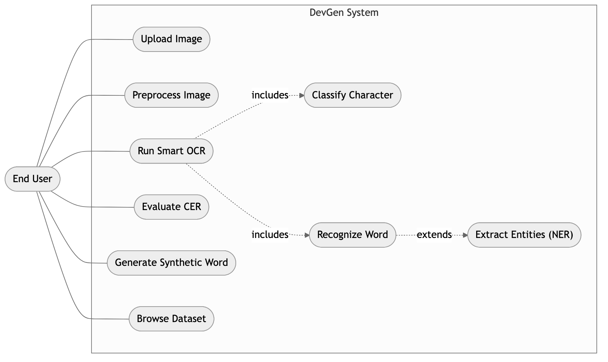{ width=80% }

**Table 3.1: Use Case Descriptions**

| Use Case | Actor | Precondition | Main Flow | Postcondition |
|---|---|---|---|---|
| Run Smart OCR | End User | Image uploaded | Preprocess → route → CNN/TrOCR → return text | Recognized text displayed |
| Extract Entities | End User | Word recognized | Apply NER regex to text | Structured fields returned |
| Evaluate CER | End User | Prediction + reference given | Compute edit distance | CER value displayed |
| Generate Word | End User | GAN checkpoint present | Encode text → sample → decode image | Synthetic image displayed |
| Browse Dataset | End User | Dataset present | Query split/page | Samples displayed |

#### ii. Non-Functional Requirements

- **Performance.** Routing under 1 ms; character prediction under ~5 ms; word recognition under ~150 ms on Apple Silicon.
- **Model size.** Compressed LoRA adapter under 20 MB.
- **Accuracy.** Target CER below 0.15 and character-classification accuracy above 97% on clean data.
- **Portability.** Runs locally without a dedicated CUDA GPU; no cloud dependency at inference.
- **Usability.** A single-page React dashboard usable by non-technical users.
- **Maintainability.** Modular backend with one responsibility per file and lazy model loading.
- **Reliability.** Graceful error handling with meaningful HTTP status codes.

### 3.1.2 Feasibility Analysis

- **Technical feasibility.** Python with the PyTorch MPS backend provides GPU-accelerated training and inference on Apple Silicon; every model and dataset used is open-source; LoRA reduces trainable parameters to a level that fits in unified memory. The project is technically feasible, as confirmed by a working prototype.
- **Operational feasibility.** The React dashboard consolidates upload, recognition, NER, evaluation, dataset inspection, and generation in one interface requiring no machine-learning knowledge from the operator. Operationally feasible.
- **Economic feasibility.** All software is free and open-source, and all computation runs on existing local hardware, so recurring cost is effectively zero. The one-time cost estimate is given in Table 3.3.
- **Schedule feasibility.** The incremental methodology partitions the work into independently deliverable modules, fitting a single academic-semester timeline as shown in Table 3.4.

**Table 3.2: Hardware and Software Requirements**

| Category | Requirement |
|---|---|
| Processor | Apple Silicon (M-series) or x86-64 with ≥ 8 cores |
| Memory | ≥ 16 GB unified/system RAM |
| Storage | ≥ 10 GB free (datasets + checkpoints) |
| OS | macOS 13+ (MPS) / Linux |
| Runtime | Python 3.10+, Node.js 18+ |
| Key libraries | PyTorch 2.0+, Transformers, PEFT, Diffusers, FastAPI, React, Vite |

**Table 3.3: Estimated Project Cost**

| Item | Cost (NPR) |
|---|---|
| Development hardware (existing laptop) | 0 (owned) |
| Software / frameworks (open-source) | 0 |
| Cloud compute | 0 (local MPS training) |
| Electricity + internet (approx.) | 5,000 |
| **Total** | **~5,000** |

**Table 3.4: Project Schedule**

| Phase | Duration | Deliverable |
|---|---|---|
| Requirement study + data acquisition | Weeks 1–2 | Datasets, requirement spec |
| Preprocessing + router | Weeks 3–4 | Working router |
| CNN + TrOCR training | Weeks 5–8 | Trained recognizers |
| Generative models | Weeks 9–12 | GAN + LDM experiments |
| Integration + UI | Weeks 13–14 | Full-stack app |
| Testing + report | Weeks 15–16 | Final report |

### 3.1.3 Object-Oriented Analysis

The system is analysed using the object-oriented approach. The principal classes and their relationships are shown in the class diagram (Figure 3.2). `ImageRouter` decides the recognition path; `CharacterClassifier` wraps the `DevanagariCNN`; `TrOCREngine` wraps the vision-encoder–decoder model and processor; `NERExtractor` post-processes recognized text; `Preprocessor` cleans inputs; and `GANGenerator` / `LDMEngine` provide synthesis. The dynamic behavior of the core "recognize and extract" flow is modeled by the sequence diagram (Figure 3.3), the activity diagram (Figure 3.4), and the state diagram (Figure 3.5).

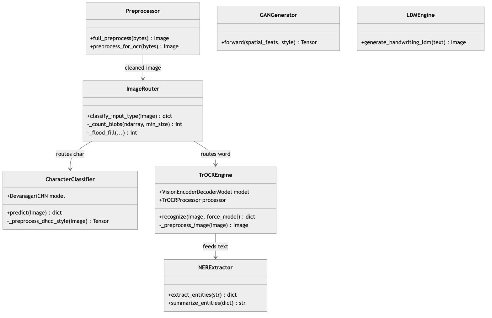{ width=95% }

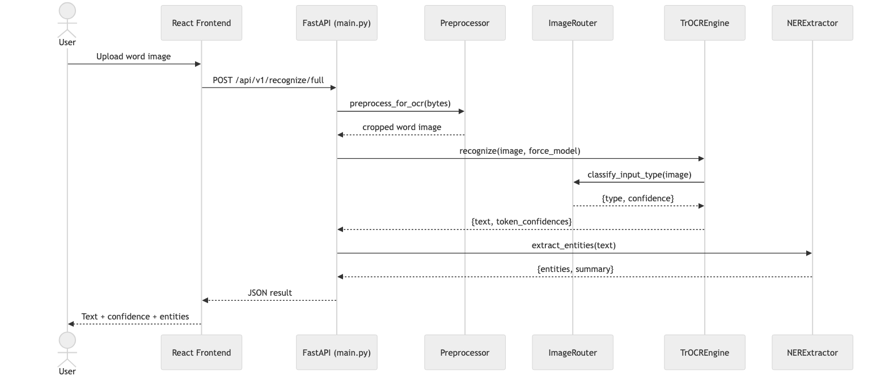{ width=95% }

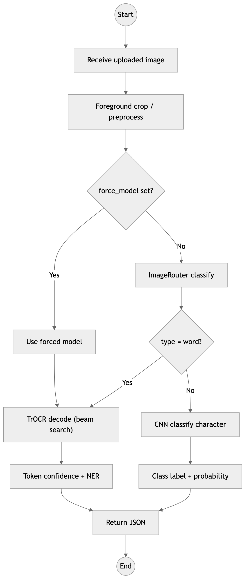{ width=72% }

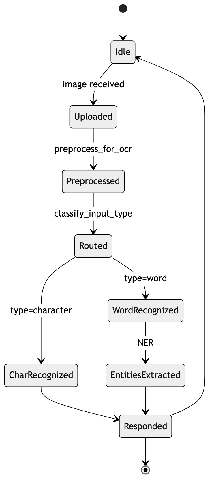{ width=68% }

**Use case description (Run Smart OCR).** The End User uploads an image through the React dashboard. The frontend issues a request to the FastAPI backend. The backend preprocesses the image (foreground crop), and the `TrOCREngine` invokes the `ImageRouter` to compute aspect ratio and blob count. Word inputs are decoded by TrOCR and passed to the `NERExtractor`; character inputs are classified by the CNN. The backend returns recognized text, per-token confidence, a preprocessed-image preview, and any extracted entities, which the frontend renders for the user.

```{=openxml}
<w:p><w:r><w:br w:type="page"/></w:r></w:p>
```

# Chapter 4: System Design

## 4.1 Design

The analysis models are refined into deployable design artifacts. The backend is decomposed into single-responsibility components (Figure 4.1); the physical deployment on a single Apple Silicon developer machine is shown in Figure 4.2; and the overall data flow through the system is shown in Figure 4.3.

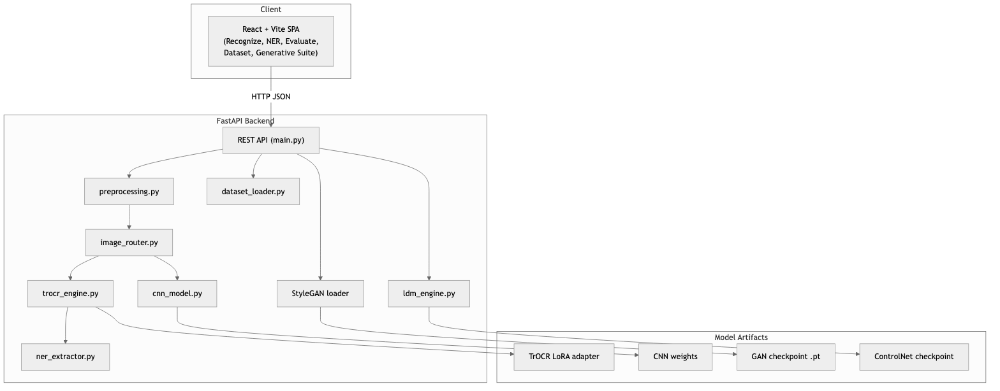{ width=85% }

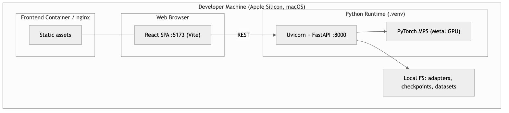{ width=80% }

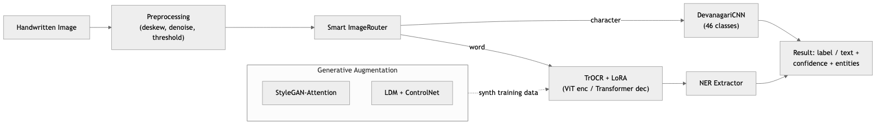{ width=95% }

The **frontend** is a React + Vite single-page application with dedicated pages for recognition, NER, evaluation, dataset exploration, and the generative suite; it communicates with the backend exclusively over a JSON REST API. The **backend** is a FastAPI application in which each concern lives in its own module (`preprocessing.py`, `image_router.py`, `cnn_model.py`, `trocr_engine.py`, `ner_extractor.py`, `ldm_engine.py`, `dataset_loader.py`), coordinated by `main.py`. Heavy ML models are *lazily loaded* on first use to keep startup fast. **Model artifacts** — the TrOCR LoRA adapter, CNN weights, GAN checkpoint, and ControlNet checkpoint — are stored on the local filesystem and discovered at runtime.

The generative subsystem is designed as two independent, swappable modules. Figure 4.4 details the StyleGAN-Attention generator and discriminator; Figure 4.5 details the LDM ControlNet pipeline.

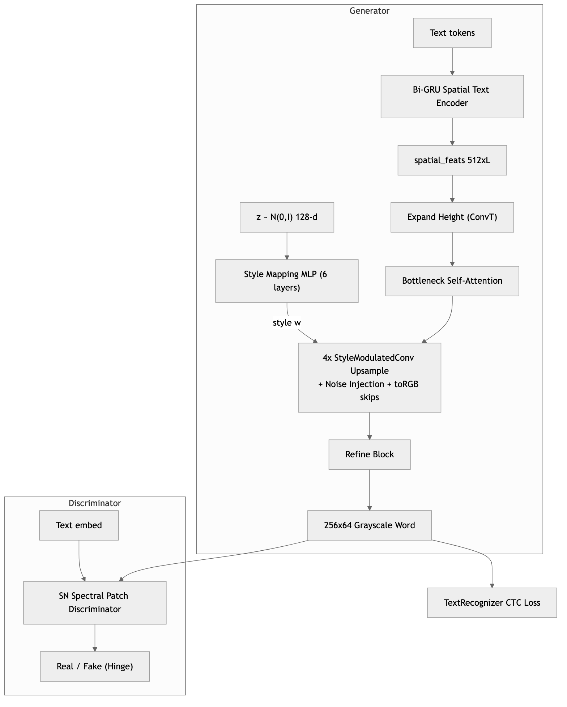{ width=80% }

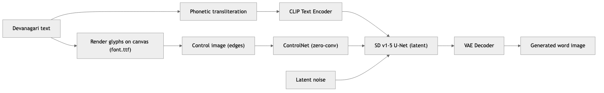{ width=95% }

## 4.2 Algorithm Details

### 4.2.1 Image Preprocessing

1. **Gaussian adaptive thresholding** computes a local threshold $T(x,y) = \mu_G(x,y) - C$ over a $15\times15$ block, where $\mu_G$ is the Gaussian-weighted mean and $C = 10$.
2. **Deskewing (Hough transform)** detects near-horizontal lines in $(\rho,\theta)$ space; the skew angle is the median angle of lines with $|\theta| < 45^{\circ}$, and the image is rotated by the corresponding affine matrix
$$M = \begin{bmatrix} \cos\theta & \sin\theta & (1-\cos\theta)x_c - y_c\sin\theta \\ -\sin\theta & \cos\theta & x_c\sin\theta + (1-\cos\theta)y_c \end{bmatrix}.$$
3. **Denoising** applies non-local means filtering.
4. **OCR foreground crop** tightly crops around the ink so the input matches the word-crop distribution used during training.

### 4.2.2 Smart ImageRouter (Iterative Flood-Fill)

The router binarizes the grayscale image using the adaptive threshold $\min(0.75\,\bar a, 200)$ and computes the ink bounding box. The aspect ratio is $\text{AspectRatio} = W_{\text{bbox}} / H_{\text{bbox}}$. Connected-component blob count is computed with a stack-based iterative flood fill; a blob is counted only if its size $S \ge \max(0.001\,N_{\text{pixels}}, 10)$. Routing rules: if $\text{AspectRatio} > 2.5$, or ($\text{AspectRatio} > 1.8$ and blobs $\ge 3$), or blobs $\ge 4$, route to **TrOCR (word)**; if $\text{AspectRatio} < 1.3$ and blobs $\le 2$, route to the **CNN (character)**; ambiguous cases are scored by aspect ratio and blob count. The decision flow is shown in Figure 1.1.

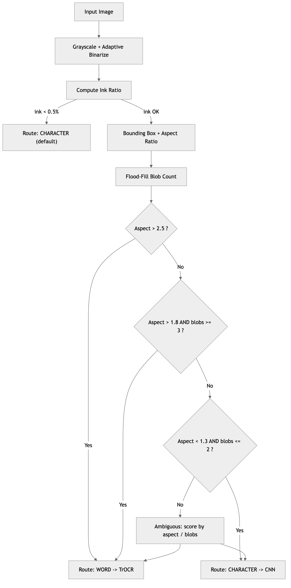{ width=78% }

### 4.2.3 CNN Character Classifier

The classifier maps a $1\times32\times32$ image to probabilities over $C = 46$ classes. Its layer specification is given in Table 4.1. It is trained by minimizing cross-entropy with the Adam optimizer.

**Table 4.1: DHCD CNN Character Classifier Layer Specification**

| Block | Layers |
|---|---|
| Block 1 | 2 × Conv2D(32, 3×3) → BatchNorm → ReLU → MaxPool(2×2) → Dropout(0.25) |
| Block 2 | 2 × Conv2D(64, 3×3) → BatchNorm → ReLU → MaxPool(2×2) → Dropout(0.25) |
| Block 3 | Conv2D(128, 3×3) → BatchNorm → ReLU → AdaptiveAvgPool(4×4) → Dropout(0.25) |
| Head | Flatten → Linear(2048, 256) → ReLU → Dropout(0.5) → Linear(256, 46) |

### 4.2.4 TrOCR Low-Rank Adaptation (LoRA)

The self-attention projections (Query, Key, Value, Output/Dense) are adapted as $W = W_0 + \frac{\alpha}{r}(BA)$, where $W_0$ is the frozen pre-trained weight, $r = 16$ is the bottleneck rank, and $\alpha = 32$ is the scaling factor. Only $A$ and $B$ are trained, giving a trainable-parameter ratio of 2.45% (4,620,288 of 188,697,376). At inference the decoder emits tokens autoregressively; **beam search** with width 4 keeps the four most probable partial sequences at each step, and per-token confidence is derived from the softmax scores of the selected sequence.

### 4.2.5 StyleGAN-Attention Text Generator

To generate $256\times64$ word crops conditioned on a text sequence:

- **Spatial text encoder.** Token indices $t$ are embedded and passed through a bidirectional GRU; a linear layer produces $\text{spatial\_feats}\in\mathbb{R}^{512\times1\times L}$, and the concatenated final hidden states form the global feature.
- **Style mapping network.** A 6-layer MLP maps pixel-normalized noise $z\sim\mathcal{N}(0,I)$ to a style vector $w$, where $z' = z / \sqrt{\tfrac1d\sum z_i^2 + 10^{-8}}$.
- **Generator modules.** Lightweight bottleneck self-attention $\text{Softmax}(QK^\top/\sqrt{d_k})V$ with channels compressed to $C/8$; StyleGAN2 weight demodulation $w''_{ijk} = s_i w_{ijk} / \sqrt{\sum_{i,k}(s_i w_{ijk})^2 + 10^{-8}}$; trainable noise injection; and multi-scale toRGB skip projections summed across resolutions to reduce gradient vanishing.
- **Stabilization.** Hinge loss with CTC guidance:
$$\mathcal{L}_D = \mathbb{E}[\max(0, 1 - D(x,c))] + \mathbb{E}[\max(0, 1 + D(G(z,c),c))],$$
$$\mathcal{L}_G = -\mathbb{E}[D(G(z,c),c)] + \lambda\,\mathcal{L}_{\text{CTC}}(G(z,c)),$$
where $\mathcal{L}_{\text{CTC}}$ is computed by a pre-trained TextRecognizer to enforce stroke-to-text correctness. Translation-only DiffAugment, TTUR ($\eta_G = 1\times10^{-4}$, $\eta_D = 4\times10^{-4}$), and EMA weight tracking are used.

### 4.2.6 Latent Diffusion Model with ControlNet

The LDM pipeline uses Stable Diffusion v1-5. Input Devanagari text is rendered onto a black canvas with a Devanagari TrueType font to form a control image, and phonetically transliterated to a Latin prompt for CLIP (e.g., नमस्ते → *"handwritten Devanagari word 'namaste' on white paper"*). A ControlNet zero-convolution branch injects the rendered glyph structure into the U-Net at each encoder resolution to steer latent denoising toward the target character shapes; the VAE decoder then maps the final latent back to pixel space.

```{=openxml}
<w:p><w:r><w:br w:type="page"/></w:r></w:p>
```

# Chapter 5: Implementation and Testing

## 5.1 Implementation

### 5.1.1 Tools Used

**Table 5.1: Hardware and Software Tool Stack**

| Component | Technology | Version / Specification |
|---|---|---|
| Language (backend) | Python | 3.10+ |
| Language (frontend) | TypeScript / JavaScript | ES2020 |
| Deep Learning | PyTorch | 2.0+ (MPS enabled) |
| Fine-Tuning | PEFT (LoRA) | Hugging Face, r=16, α=32 |
| OCR model | Transformers (TrOCR) | VisionEncoderDecoderModel |
| Diffusion | Diffusers | Stable Diffusion v1-5 + ControlNet |
| Image processing | OpenCV, Pillow, NumPy | latest |
| Backend framework | FastAPI + Uvicorn | REST API |
| Frontend | React + Vite | SPA dashboard |
| Packaging | Docker, docker-compose | Backend + frontend containers |
| Hardware | Apple Silicon (macOS) | Metal GPU via MPS |

**Table 5.2: Dataset Split Sizes (IIIT-INDIC-HW-WORDS-Hindi, local extraction)**

| Split | Label rows (excluding header) |
|---|---:|
| Train | 69,853 |
| Validation | 12,708 |
| Test | 12,869 |
| **Total** | **95,430** |

### 5.1.2 Implementation Details of Modules

The backend follows a one-responsibility-per-module layout coordinated by `main.py`:

- **Smart router — `backend/image_router.py`.** `classify_input_type()` converts the image to grayscale, binarizes it with an adaptive threshold, computes the ink bounding box and aspect ratio, and counts connected components using iterative flood fill (`_count_blobs`, `_flood_fill`). It returns the route (`character`/`word`) with a confidence and a human-readable `reason` code, and runs in well under one millisecond because it uses only NumPy operations and no ML model.
- **CNN character model — `backend/cnn_model.py`.** Defines the `DevanagariCNN` architecture (Table 4.1) together with DHCD-style binarization and contour cropping so that inference inputs match the training distribution of centered $32\times32$ character images.
- **TrOCR engine — `backend/trocr_engine.py`.** Performs runtime artifact inspection, automatic checkpoint discovery, explicit adapter selection via the `TROCR_ADAPTER_PATH` environment variable, MPS device selection with CPU fallback, LoRA adapter loading (with optional merge), beam-search generation, and token-level confidence extraction. The `CERCalculator` class computes edit-distance CER. A processor *fallback* builds a `TrOCRProcessor` manually (tokenizer + ViT image processor) when the checkpoint's processor metadata is not recognized by the installed Transformers version.
- **TrOCR training — `backend/train_trocr.py`.** A sequence-to-sequence trainer supporting both Hugging Face and local dataset loading, LoRA attachment, CER computation, MPS-compatible training arguments, and best-checkpoint tracking by validation CER. Adapter weights are saved with `save_embedding_layers=False` to avoid a PEFT/`VisionEncoderDecoderConfig` save issue.
- **NER extractor — `backend/ner_extractor.py`.** Regular-expression extraction of Nepali dates (both Devanagari ०–९ and ASCII digits), citizenship numbers, plot (*killa*) and sheet (*paana*) numbers, districts, provinces, and wards, plus a catch-all for other multi-digit IDs and a summary formatter.
- **Preprocessing — `backend/preprocessing.py`.** `full_preprocess()` for document-style cleanup and `preprocess_for_ocr()` for tight word-crop foreground cropping.
- **Generative modules.** The StyleGAN-Attention loader in `backend/main.py` reconstructs `AdvancedStyleGANAttentionGenerator`, `SpatialTextEncoder`, and `StyleMappingNetwork`, loading the EMA generator when available; the training notebook is `DevGen_StyleGAN_Attn.ipynb`. The LDM lives in `backend/ldm_engine.py` and `DevGen_LDM_ControlNet.ipynb`.
- **Dataset loader — `backend/dataset_loader.py`.** Provides metadata, single-sample, random, and paginated access used by the dataset-explorer UI.
- **API — `backend/main.py`.** A FastAPI application exposing health, dataset, preprocess, recognize, recognize/full, evaluate, NER, and generate (GAN / LDM) endpoints with lazy model loading and permissive CORS for local development. The full endpoint list is given in Appendix C.

The main training run used:

```bash
PYTORCH_ENABLE_MPS_FALLBACK=1 .venv/bin/python -m backend.train_trocr \
  --base-model paudelanil/trocr-devanagari-2 \
  --data-dir ./data --output-dir ./trocr-devanagari-lora \
  --epochs 2 --batch-size 4 --eval-batch-size 4 --grad-accum 2 \
  --learning-rate 1e-5 --eval-limit 1000 --eval-steps 1000 \
  --save-steps 1000 --logging-steps 50
```

giving an effective batch size of 4 × 2 = 8. The LoRA configuration was `r=16, lora_alpha=32, lora_dropout=0.05, target_modules=[query, value, key, dense]`, yielding 4,620,288 trainable of 188,697,376 total parameters (2.45%).

## 5.2 Testing

Testing followed two levels: **unit testing** of individual functions/modules and **system testing** of the integrated end-to-end application. Table 5.4 summarizes all cases.

### 5.2.1 Test Cases for Unit Testing

**Unit Test 1 — Image Routing Validation.** *Input:* character image (aspect ratio 1.02, 1 blob). *Expected:* `{"type": "character"}`. *Observed:* `{"type": "character", "confidence": 0.90, "reason": "square_single_blob"}`. **Result: Pass.**

**Unit Test 2 — Character Classification.** *Input:* handwritten क. *Expected:* prediction क, confidence > 0.8. *Observed:* क, confidence 0.9852. **Result: Pass.**

**Unit Test 3 — TrOCR Word Recognition.** *Input:* handwritten word शरावती. *Expected:* prediction शरावती, CER = 0.0. *Observed:* शरावती, CER 0.0. **Result: Pass.**

**Unit Test 4 — CER Calculator.** *Input:* prediction नेपाल, reference नेपाली. *Expected:* CER = 1/5 = 0.2. *Observed:* 0.2. **Result: Pass.**

**Unit Test 5 — NER Extraction.** *Input:* text containing `2078/03/15` and `काठमाडौं`. *Expected:* date and district extracted. *Observed:* `dates=["2078/03/15"]`, `districts=["काठमाडौं"]`. **Result: Pass.**

**Unit Test 6 — Empty/low-ink image.** *Input:* near-blank image. *Expected:* default to `character` with low confidence. *Observed:* `{"type": "character", "confidence": 0.5, "reason": "very_low_ink"}`. **Result: Pass.**

### 5.2.2 Test Cases for System Testing

**System Test 1 — End-to-end recognition.** Upload a word image through the React UI → `POST /api/v1/recognize/full`. Expected: recognized text, preprocessed image, per-token confidence, and entity summary returned and rendered. **Result: Pass.**

**System Test 2 — Routing dispatch.** Upload a single-character crop and a multi-character word crop. Expected: character crop handled as a character, word crop decoded by TrOCR. **Result: Pass.**

**System Test 3 — Generation endpoint.** Request `POST /api/v1/generate` with a target word. Expected: base64 grayscale 256×64 images returned. **Result: Pass** (visually valid strokes; semantic legibility limited — see 5.3).

**System Test 4 — Preprocessing distribution fix.** Compare recognition before and after foreground cropping. Expected: cropped input improves prediction quality versus a padded 384×384 canvas. **Result: Pass.**

**System Test 5 — Model info / health.** `GET /` and `GET /api/v1/model/info`. Expected: status, adapter path, and device reported. **Result: Pass.**

**Table 5.4: Summary of Test Cases**

| ID | Type | Focus | Result |
|---|---|---|---|
| UT1 | Unit | Router — character | Pass |
| UT2 | Unit | CNN classification | Pass |
| UT3 | Unit | TrOCR word | Pass |
| UT4 | Unit | CER calculation | Pass |
| UT5 | Unit | NER extraction | Pass |
| UT6 | Unit | Empty-image handling | Pass |
| ST1 | System | End-to-end OCR + NER | Pass |
| ST2 | System | Routing dispatch | Pass |
| ST3 | System | GAN generation | Pass |
| ST4 | System | Preprocessing fix | Pass |
| ST5 | System | Health / model info | Pass |

## 5.3 Result Analysis

### 5.3.1 TrOCR Checkpoint Progression

**Table 5.3: TrOCR Validation CER across Checkpoints**

| Checkpoint | Epoch | Validation CER | Validation Loss |
|---:|---:|---:|---:|
| 9000 | 1.03 | 0.1409 | 0.2461 |
| 10000 | 1.15 | 0.1471 | 0.2478 |
| 11000 | 1.26 | 0.1457 | 0.2352 |
| 12000 | 1.37 | 0.1428 | 0.2345 |
| 13000 | 1.49 | 0.1440 | 0.2389 |
| 14000 | 1.60 | **0.1380** | 0.2339 |

The curve improves through checkpoint 9000, degrades temporarily at 10000–11000, then recovers to the best measured CER of 0.1380 at checkpoint 14000. This non-monotonic behavior justifies saving intermediate checkpoints and selecting by validation CER rather than using the final training step blindly.

### 5.3.2 Diagnostic Metrics

A quantitative benchmark was executed on a 50-sample subset of the `c3rl/IIIT-INDIC-HW-WORDS-Hindi` test split, computing not only CER but the full set of diagnostic metrics defined in Section 2.1.10.

**Table 5.5: OCR Sequence Recognition Results (TrOCR + LoRA)**

| Metric | Score | Diagnostic Profile |
|---|---|---|
| Character Error Rate | 0.3955 | Sequence edit distance on raw test crops |
| Word Exact Match | 46.00% | Fully correct word recognitions |
| Character Precision | 0.7477 | Low insertion error |
| Character Recall | 0.8588 | High stroke sensitivity |
| Character F1-Score | 0.7910 | Balanced token prediction |

**Table 5.6: Character Classification Results (Custom CNN)**

| Metric | Score | Context |
|---|---|---|
| Clean DHCD Test Accuracy | 98.20% | Hand-centered clean test split |
| Segmented Character Accuracy | 15.71% | Heuristic word-segmentation crops |
| Macro Precision | 0.3155 | Sensitive to segmentation fragmentation |
| Macro Recall | 0.1463 | Accents / disconnected strokes omitted |
| Macro F1-Score | 0.1753 | Low stability on noisy real crops |

**Table 5.7: StyleGAN-Attention OCR Read Correctness**

| Metric | Score | Interpretation |
|---|---|---|
| Synthetic Image CER | 2.3226 | Mismatch between conditioning text and OCR read |
| Synthetic Image Exact Match | 0.00% | Prompt reconstruction rate on generated images |

For GAN quality, three complementary methodologies were considered: **FID** (fidelity/coverage between real and synthetic feature distributions), **precision/recall for GANs** (how much generated mass lies on the real manifold, and how much of the real manifold is covered), and **OCR-based semantic accuracy** — feeding generated word images back into the fine-tuned TrOCR and measuring how well it reads the intended word. The last is the most decisive for handwriting, because it directly tests whether the generated strokes spell the target; Table 5.7 reports it.

### 5.3.3 Analysis

- **Why segmented CNN performance degrades.** The CNN reaches 98.2% on clean, pre-centered DHCD characters but drops to 15.71% on characters segmented from real words. The heuristic segmenter removes the *Shirorekha* and uses connected components, but handwriting lines are highly irregular: characters are sliced into multiple sub-components, *matras* are left attached or split off, and adjacent strokes bleed together. The resulting off-center, fragmented crops constitute a severe out-of-distribution shift for a classifier trained on clean isolated glyphs. This quantitatively demonstrates why segmentation-free sequence models such as TrOCR are vastly preferable for practical document OCR, and it is the empirical justification for DevGen's hybrid routing design.
- **Semantic gap in GAN generation.** The GAN produces crisp, realistic strokes and convincing Devanagari shapes (high visual fidelity), yet yields a high OCR-read CER (2.3226) and 0% exact match. The mapping from conditioning tokens to physical character layout is not tightly constrained, so TrOCR's language-model priors bias it toward reading alternative valid words. This exposes the central *semantic gap* of handwriting synthesis: generating structurally realistic strokes is far easier than guaranteeing they spell the conditioning target. The CTC guidance term reduces but does not close this gap at the data scale available.
- **Why the LDM ControlNet pipeline failed.** The diffusion pipeline produced distorted, blurry text that failed OCR read tests, for four compounding reasons. (1) *Stochastic stroke sensitivity* — iterative denoising introduces high-frequency spatial shifts; while negligible for natural images, a few-pixel deviation can break stroke connectivity or merge letters, which is fatal for topologically strict handwriting. (2) *CLIP vocabulary misalignment* — Stable Diffusion's CLIP text encoder is trained on English web captions and has no structural representation of Devanagari, so even transliterated prompts cannot be mapped to correct glyph layouts. (3) *Data-scale constraints* — forming sharp ControlNet stroke edges needs hundreds of thousands of clean pairs, far more than the available Indic data, yielding fuzzy ink blots. (4) *Compute and gradient overhead* — fine-tuning the SD U-Net under MPS suffered from high gradient instability and slow convergence relative to direct GAN training under CTC guidance. Together these explain why the GAN was the more practical generator for this task and hardware.

```{=openxml}
<w:p><w:r><w:br w:type="page"/></w:r></w:p>
```

# Chapter 6: Conclusion and Future Recommendations

## 6.1 Conclusion

The DevGen framework successfully integrates a hybrid, smart-routed OCR reader with a conditional word generator, delivered as a complete full-stack application. The flood-fill aspect-ratio router optimizes hardware use by dispatching isolated symbols and digits to a lightweight CNN while reserving the transformer-based TrOCR model for words. LoRA fine-tuning reduced the trainable parameters to just 2.45% of the model, making local training on consumer Apple Silicon (MPS) feasible and reaching a best validation Character Error Rate of 0.1380. A key practical lesson emerged during deployment: recognition quality depends strongly on matching the inference preprocessing to the training word-crop distribution, and adding foreground cropping materially improved results on real uploads.

For synthetic augmentation, the StyleGAN-Attention network with CTC recognizer feedback stabilized and produced visually realistic strokes, clearly outperforming the LDM ControlNet pipeline, which was hampered by diffusion stroke noise and CLIP's lack of a Devanagari representation. However, the GAN still exhibits a semantic gap between stroke realism and correct spelling, and the CNN's collapse on segmented crops confirms that segmentation-free recognition is the right architectural choice. Overall, the project demonstrates that transformer-scale Devanagari OCR and non-trivial generative modeling are achievable on accessible hardware, and it provides a solid, extensible foundation for word-level Devanagari handwriting recognition.

## 6.2 Future Recommendations

- **Improve the ControlNet pipeline** by replacing CLIP with a Devanagari-native text encoder (e.g., IndicBERT) and using binary distance-field conditioning to enforce clean, connected character lines.
- **Add layout parsing** — a text-line and word detection stage to enable multi-word and full-page document reading rather than pre-cropped inputs.
- **Strengthen augmentation** with elastic deformation, perspective transforms, blur, and brightness/contrast jitter to mimic real camera capture, and use the stabilized GAN to synthesize additional labeled training words.
- **Run full evaluation** — compute complete validation and test-set CER for the best checkpoint instead of a 1,000-sample subset, and compare against the base checkpoint and full fine-tuning.
- **Close the semantic gap** — increase CTC loss weighting or add a recognizer-in-the-loop reward so generated words reliably spell their conditioning text.
- **Calibrate confidence** — replace raw beam-search sequence scores with confidence calibrated against validation reliability.
- **Replace rule-based NER** with a trained Devanagari NER model to generalize beyond hand-written regular expressions.

```{=openxml}
<w:p><w:r><w:br w:type="page"/></w:r></w:p>
```

# References

1. M. Li, T. Lv, J. Chen, L. Cui, Y. Lu, D. Florencio, C. Zhang, Z. Li, and F. Wei, "TrOCR: Transformer-based Optical Character Recognition with Pre-trained Models," *Proc. AAAI*, 2023 (arXiv:2109.10282, 2021). Available: https://arxiv.org/abs/2109.10282
2. E. J. Hu, Y. Shen, P. Wallis, Z. Allen-Zhu, Y. Li, S. Wang, L. Wang, and W. Chen, "LoRA: Low-Rank Adaptation of Large Language Models," *Proc. ICLR*, 2022 (arXiv:2106.09685). Available: https://arxiv.org/abs/2106.09685
3. R. K. Chhatkuli, H. P. Baral, and S. KC, "Generating Nepali Handwritten Letters and Words Using Generative Adversarial Networks," 2021.
4. T. Karras, S. Laine, M. Aittala, J. Hellsten, J. Lehtinen, and T. Aila, "Analyzing and Improving the Image Quality of StyleGAN (StyleGAN2)," *Proc. CVPR*, 2020 (arXiv:1912.04958). Available: https://arxiv.org/abs/1912.04958
5. R. Rombach, A. Blattmann, D. Lorenz, P. Esser, and B. Ommer, "High-Resolution Image Synthesis with Latent Diffusion Models," *Proc. CVPR*, 2022 (arXiv:2112.10752). Available: https://arxiv.org/abs/2112.10752
6. L. Zhang, A. Rao, and M. Agrawala, "Adding Conditional Control to Text-to-Image Diffusion Models (ControlNet)," *Proc. ICCV*, 2023 (arXiv:2302.05543). Available: https://arxiv.org/abs/2302.05543
7. A. Dosovitskiy et al., "An Image is Worth 16×16 Words: Transformers for Image Recognition at Scale (ViT)," *Proc. ICLR*, 2021 (arXiv:2010.11929). Available: https://arxiv.org/abs/2010.11929
8. A. Vaswani et al., "Attention Is All You Need," *Proc. NeurIPS*, 2017 (arXiv:1706.03762). Available: https://arxiv.org/abs/1706.03762
9. H. Zhang, I. Goodfellow, D. Metaxas, and A. Odena, "Self-Attention Generative Adversarial Networks (SAGAN)," *Proc. ICML*, 2019 (arXiv:1805.08318). Available: https://arxiv.org/abs/1805.08318
10. S. Zhao, Z. Liu, J. Lin, J.-Y. Zhu, and S. Han, "Differentiable Augmentation for Data-Efficient GAN Training (DiffAugment)," *Proc. NeurIPS*, 2020 (arXiv:2006.10738). Available: https://arxiv.org/abs/2006.10738
11. T. Miyato, T. Kataoka, M. Koyama, and Y. Yoshida, "Spectral Normalization for Generative Adversarial Networks," *Proc. ICLR*, 2018 (arXiv:1802.05957). Available: https://arxiv.org/abs/1802.05957
12. M. Heusel, H. Ramsauer, T. Unterthiner, B. Nessler, and S. Hochreiter, "GANs Trained by a Two Time-Scale Update Rule Converge to a Local Nash Equilibrium (FID / TTUR)," *Proc. NeurIPS*, 2017 (arXiv:1706.08500). Available: https://arxiv.org/abs/1706.08500
13. A. Graves, S. Fernández, F. Gomez, and J. Schmidhuber, "Connectionist Temporal Classification: Labelling Unsegmented Sequence Data with Recurrent Neural Networks," *Proc. ICML*, 2006. Available: https://www.cs.toronto.edu/~graves/icml_2006.pdf
14. A. Radford et al., "Learning Transferable Visual Models From Natural Language Supervision (CLIP)," *Proc. ICML*, 2021 (arXiv:2103.00020). Available: https://arxiv.org/abs/2103.00020
15. S. Acharya, A. K. Pant, and P. K. Gyawali, "Deep Learning Based Large Scale Handwritten Devanagari Character Recognition (DHCD)," *Proc. SKIMA*, 2015. Available: https://doi.org/10.1109/SKIMA.2015.7400041

# Bibliography

1. `c3rl/IIIT-INDIC-HW-WORDS-Hindi` — Hugging Face dataset card. https://huggingface.co/datasets/c3rl/IIIT-INDIC-HW-WORDS-Hindi
2. `paudelanil/trocr-devanagari-2` — Hugging Face TrOCR Devanagari model card. https://huggingface.co/paudelanil/trocr-devanagari-2
3. Devanagari Handwritten Character Dataset (DHCD) — UCI Machine Learning Repository. https://archive.ics.uci.edu/dataset/389/devanagari+handwritten+character+dataset
4. PyTorch MPS backend documentation. https://pytorch.org/docs/stable/notes/mps.html
5. Hugging Face PEFT (LoRA) library documentation. https://huggingface.co/docs/peft
6. Hugging Face Diffusers (Stable Diffusion / ControlNet) documentation. https://huggingface.co/docs/diffusers
7. Hugging Face Transformers — TrOCR model documentation. https://huggingface.co/docs/transformers/model_doc/trocr
8. FastAPI documentation. https://fastapi.tiangolo.com
9. React + Vite documentation. https://vitejs.dev/guide

```{=openxml}
<w:p><w:r><w:br w:type="page"/></w:r></w:p>
```

# Appendices

## Appendix A: Smart Router Core Algorithm

```python
def classify_input_type(image: Image.Image) -> dict:
    gray = image.convert("L")
    arr = np.array(gray)
    threshold = min(arr.mean() * 0.75, 200)
    binary = (arr < threshold).astype(np.uint8)
    rows = np.any(binary, axis=1)
    cols = np.any(binary, axis=0)
    if not rows.any() or not cols.any():
        return {"type": "character", "confidence": 0.5}
    rmin, rmax = np.where(rows)[0][[0, -1]]
    cmin, cmax = np.where(cols)[0][[0, -1]]
    aspect_ratio = (cmax - cmin + 1) / max((rmax - rmin + 1), 1)
    blob_count = _count_blobs(binary, min_size=max(binary.size * 0.001, 10))
    if aspect_ratio > 2.5 or (aspect_ratio > 1.8 and blob_count >= 3):
        return {"type": "word", "confidence": 0.90}
    return {"type": "character", "confidence": 0.90}
```

## Appendix B: NER Field Extraction (excerpt)

```python
DATE_PATTERN = re.compile(
    rf"(?:{_DIGITS}{{4}}[\/\-\.]{_DIGITS}{{1,2}}[\/\-\.]{_DIGITS}{{1,2}})")
CITIZENSHIP_PATTERN = re.compile(r"\b(?:\d{2}-\d{2}-\d{2}-\d{5}|\d{8,12})\b")

def extract_entities(text: str) -> dict:
    entities = {"dates": [], "citizenship_numbers": [], "districts": [], ...}
    entities["dates"] = list(set(DATE_PATTERN.findall(text)))
    entities["citizenship_numbers"] = list(set(CITIZENSHIP_PATTERN.findall(text)))
    entities["districts"] = list(set(DISTRICT_PATTERN.findall(text)))
    return entities
```

## Appendix C: REST API Endpoints

| Method | Endpoint | Purpose |
|---|---|---|
| GET | `/` | Health check + model info |
| GET | `/api/v1/model/info` | Model configuration / checkpoint status |
| GET | `/api/v1/dataset/info` | Dataset metadata |
| GET | `/api/v1/dataset/sample` | Single sample by index |
| GET | `/api/v1/dataset/random` | Random samples |
| GET | `/api/v1/dataset/browse` | Paginated samples |
| POST | `/api/v1/preprocess` | Preprocess an image |
| POST | `/api/v1/recognize` | OCR recognition |
| POST | `/api/v1/recognize/full` | OCR + NER |
| POST | `/api/v1/evaluate` | CER evaluation |
| POST | `/api/v1/ner` | NER from text |
| POST | `/api/v1/generate` | StyleGAN generation |
| GET | `/api/v1/generate/info` | GAN model info |
| POST | `/api/v1/generate/ldm` | LDM ControlNet generation |
| GET | `/api/v1/generate/ldm/info` | LDM model info |

## Appendix D: Log of Visits to Supervisor

| S.N. | Date | Agenda / Discussion | Supervisor Signature |
|---|---|---|---|
| 1 | | Project topic selection and scope | |
| 2 | | Dataset and model selection review | |
| 3 | | LoRA fine-tuning progress | |
| 4 | | Generative module (GAN / LDM) review | |
| 5 | | Results, testing, and report review | |

## Appendix E: Research Paper and Resource Links

**Core research papers**

| Topic | Paper | Link |
|---|---|---|
| TrOCR | Li et al., "TrOCR: Transformer-based OCR with Pre-trained Models," AAAI 2023 | https://arxiv.org/abs/2109.10282 |
| LoRA | Hu et al., "LoRA: Low-Rank Adaptation of Large Language Models," ICLR 2022 | https://arxiv.org/abs/2106.09685 |
| ViT | Dosovitskiy et al., "An Image is Worth 16×16 Words," ICLR 2021 | https://arxiv.org/abs/2010.11929 |
| Transformer | Vaswani et al., "Attention Is All You Need," NeurIPS 2017 | https://arxiv.org/abs/1706.03762 |
| StyleGAN2 | Karras et al., "Analyzing and Improving the Image Quality of StyleGAN," CVPR 2020 | https://arxiv.org/abs/1912.04958 |
| SAGAN | Zhang et al., "Self-Attention Generative Adversarial Networks," ICML 2019 | https://arxiv.org/abs/1805.08318 |
| DiffAugment | Zhao et al., "Differentiable Augmentation for Data-Efficient GAN Training," NeurIPS 2020 | https://arxiv.org/abs/2006.10738 |
| Spectral Norm | Miyato et al., "Spectral Normalization for GANs," ICLR 2018 | https://arxiv.org/abs/1802.05957 |
| FID / TTUR | Heusel et al., "GANs Trained by a Two Time-Scale Update Rule," NeurIPS 2017 | https://arxiv.org/abs/1706.08500 |
| CTC | Graves et al., "Connectionist Temporal Classification," ICML 2006 | https://www.cs.toronto.edu/~graves/icml_2006.pdf |
| Latent Diffusion | Rombach et al., "High-Resolution Image Synthesis with Latent Diffusion Models," CVPR 2022 | https://arxiv.org/abs/2112.10752 |
| ControlNet | Zhang et al., "Adding Conditional Control to Text-to-Image Diffusion Models," ICCV 2023 | https://arxiv.org/abs/2302.05543 |
| CLIP | Radford et al., "Learning Transferable Visual Models From Natural Language Supervision," ICML 2021 | https://arxiv.org/abs/2103.00020 |
| DHCD | Acharya et al., "Deep Learning Based Large Scale Handwritten Devanagari Character Recognition," SKIMA 2015 | https://doi.org/10.1109/SKIMA.2015.7400041 |

**Datasets, models, and frameworks**

| Resource | Link |
|---|---|
| IIIT-INDIC-HW-WORDS-Hindi (dataset) | https://huggingface.co/datasets/c3rl/IIIT-INDIC-HW-WORDS-Hindi |
| paudelanil/trocr-devanagari-2 (base model) | https://huggingface.co/paudelanil/trocr-devanagari-2 |
| DHCD (UCI repository) | https://archive.ics.uci.edu/dataset/389/devanagari+handwritten+character+dataset |
| PyTorch MPS backend | https://pytorch.org/docs/stable/notes/mps.html |
| Hugging Face PEFT (LoRA) | https://huggingface.co/docs/peft |
| Hugging Face Diffusers | https://huggingface.co/docs/diffusers |
| Hugging Face Transformers — TrOCR | https://huggingface.co/docs/transformers/model_doc/trocr |
| FastAPI | https://fastapi.tiangolo.com |
| React + Vite | https://vitejs.dev/guide |
